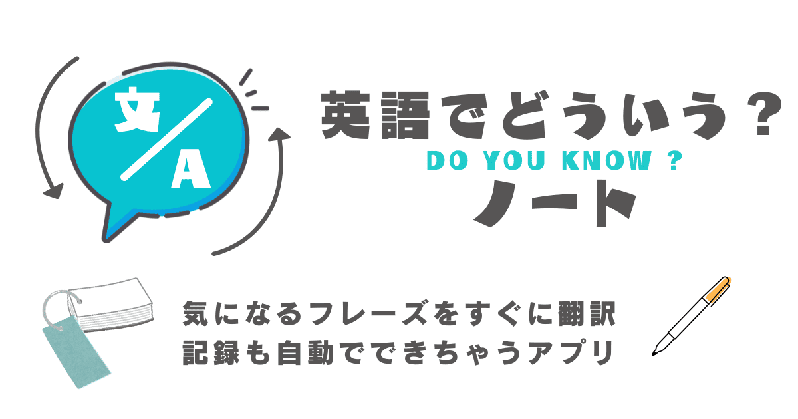

# 英語でどういう？ノート



## 概要
### 「これって英語でどう言えばいいんだろう？」
そう考えてせっかく調べてもすぐに忘れてしまっていませんか？

「英語でどういう？ノート」なら、フレーズの翻訳と記録を同時にしてくれるので、気になるフレーズをただ入力するだけであなただけのフレーズ帳を簡単に作成できます！

**例えば、偉人の名言を英語でどういうのか翻訳してストックしておくこともできます！**


## 特徴１：　書き写す作業をゼロに！翻訳結果をワンクリックで保存！
自動翻訳の結果をその場ですぐに保存できるので、別のメモアプリへコピペしたり、ノートやカードに書き写したりする**面倒な作業が一切ありません！**


## 【特徴2】単語カード形式で気軽に復習！
翻訳結果の英文を隠した状態から始まる「復習モード」を使うことで、**紙の単語カードと同じように気軽に復習をすることができます！**
どんどん覚えてチェックを入れていきましょう！


## URL

https://eigo-de-do-you-note.fly.dev

## 使い方

### カードの新規作成

1. 画面右下にある「＋」ボタンを押して翻訳画面を開く。
   
   

2. 翻訳したい日本語または英語のフレーズを入力し、「翻訳する」ボタンを押す。（日本語は100文字、英語はスペースを含む200文字まで翻訳できます。）
   
   

3. 入力したフレーズと翻訳結果が一枚のカードに記録されます。あとで復習モードで見返して記憶に定着したカードは、右側にあるボタンを押してチェックしましょう。復習モードで出題されなくなります。

   

5. また、一度覚えたものでも時間が経って忘れてしまった場合は、チェックを外せばまた復習モードで出題されるようになるので何度でも繰り返し学習できます。

### 復習モード

1. 日本語だけを見て英語のフレーズを思い出す。（声に出して音読すると効果的です。）
1. 「英文を表示」を押して、1.で思い出した英文が合っていたか確認する。
1. スラスラ言えるようになるまで1と2を何度も繰り返す。
1. 覚えたフレーズはチェックボタンを押す。（復習モードで出題されなくなります。）
1. 「次のカードへ」または「前のカードへ」を押すと別のカードが出題される。

## 開発環境

- Ruby 3.3.5
- Ruby on Rails 7.2.2
- Hotwire

## 開発時のセットアップ・起動
### セットアップ

```
$ git clone https://github.com/ham-cap/eigo-de-do-you-note.git
$ cd eigo-de-do-you-note
$ bin/setup
```
### 起動
```
$ bin/dev
```
上記を実行後、`http://localhost:3000`にアクセスして以下のようなトップページが表示されれば成功です。


### ログインおよび翻訳機能に必要な環境変数の設定について
このアプリでのログイン処理と翻訳機能の使用には環境変数の設定が必要です。
それぞれをご用意のうえ`.env`に追記してご利用ください。
| 名称 | 備考 |
| --- | --- |
| GOOGLE_CLIENT_ID | GoogleのクライアントID |
| GOOGLE_CLIENT_SECRET | Googleのクライアントシークレット |
| DEEPL_API_KEY | DeepLの翻訳APIキー |

```
$ cd eigo-de-do-you-note
$ cp .envrc.example .envrc
$ vi .envrc # GOOGLE_CLIENT_ID・GOOGLE_CLIENT_SECRET・DEEPL_API_KEYを追記
```
